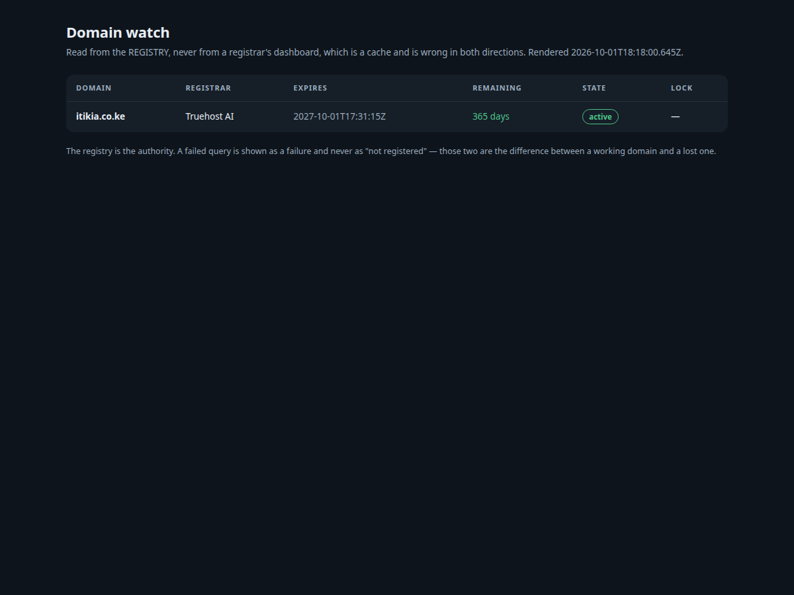

# dsh-domain-watch

**Ask the registry, not the vendor's dashboard.** A registrar's control panel is a cache of the
registry, and this plugin answers the only question that matters when money has changed hands:
*is the domain actually mine?*

```bash
curl 'http://127.0.0.1:3080/domain-watch/check?domain=example.co.ke&claimed=paid&json=1'
```

## The incident this was built from

On 1 October 2026 a hosting invoice was marked **PAID**. The order showed **active** in the vendor's
dashboard. There was a receipt, an invoice number, and a customer who believed they owned a domain.

KENIC's registry had **no record of it at all.**

The panel was not lying, exactly. It was a cache, and the cache had not been written to the
registry. Days went by waiting on a queue that was never going to complete, an escalation clock ran,
and a refund had to be requested — for a domain that could have been registered correctly in the
first ten minutes.

Three days later the same thing happened **in the other direction**: the panel said **Pending** for a
domain the registry had already made `active`, and it took a registry query to know that nothing was
wrong.

A cache is wrong in both directions. The fix is not a better dashboard. The fix is asking the
authority, and refusing to average the two answers into a comfortable middle.



## What it does

Four agent tools and one host-rendered page.

| Tool | Answers |
|---|---|
| `domain_check` | Is it registered? Registrar of record, created, expiry, days remaining, transfer lock — and, if you pass `claimed`, whether the panel and the registry **disagree** |
| `domain_watch_add` | Start watching: one registry query, then remember the answer |
| `domain_watch_remove` | Stop watching. Removes the record only; never touches the domain |
| `domain_watch_list` | Every watched domain, soonest to expire first, countdown recomputed live |

The board is at **`/domain-watch/ui`** — a server-rendered page in its own tab, no client bundle, no
JavaScript required. Countdowns are computed per request from the remembered registry answers, so the
numbers move even when nobody clicks anything. That is the point: the failure being guarded against
is time passing.

## The verdicts

`domain_check` does not just look things up. Given what a panel told you, it names the disagreement:

| Verdict | Meaning |
|---|---|
| `confirmed` | Both agree. |
| `registry-ahead` | The registry **already has it**; the panel is a lagging cache. **Do not re-order.** |
| **`registry-silent`** | **The panel says it is yours and the registry has no record. You do not own this name yet.** |
| `in-progress` | Neither shows it registered. The order has not landed. |
| `registry-only` | No claim was given, so this is the registry answer alone. |

## Three decisions worth knowing about

**A failed query is never reported as "not registered".** A network error and a missing domain are
indistinguishable to a caller that only sees an empty string, and conflating them is how you pay
twice for a domain you already own. Errors are reported as errors.

**An unknown TLD is an error, not a guess.** Verisign serves `.com` and `.net`; it does *not* serve
`.org`, `.io` or `.dev`. Ask it about one of those and it answers *"No match"* — which reads as
*available* and is really *you asked the wrong server*. A registry that is not in the map returns an
explicit error, because a wrong answer is worse than no answer: the wrong answer is the one you act
on. Add TLDs from the IANA root database; never infer one from a similar TLD.

**A `put` merges.** Re-checking a domain must not erase your note, and adding a note must not erase
the registry answer. Every write reads-then-merges through one helper, so `undefined` means *leave
it* and never *clear it*.

## Install

```bash
DEST="$DSH_HOME/profiles/web/node_modules/dsh-domain-watch"
mkdir -p "$DEST"
cp -r lib package.json cordis.patch.yml "$DEST"/
```

```yaml
# $DSH_HOME/profiles/web/cordis.patch.yml  (append)
- insert:
    - id: domain-watch
      name: 'dsh-domain-watch'
      config:
        domains:
          - example.co.ke
        # Registry policy, not universal law. These defaults are KENIC's.
        suspendAfterDays: 14
        deleteAfterDays: 90
        warnWithinDays: 60
```

Then restart the host so the new entry is composed. `@deepseek-ai/*` imports resolve through the
shared profile tree, so nothing needs installing.

> **Do not use `dsh plugin add` for this.** It forwards to a package manager *inside the profile
> directory*, which materialises a second physical copy of `@deepseek-ai/dsh-tools` — and two copies
> mean two module-level `Symbol`s, so every tool call in the session dies with
> `Cannot read properties of undefined (reading 'prepare')`. Copying real files avoids it entirely.

## Configuration

| Key | Default | Meaning |
|---|---|---|
| `domains` | `[]` | Domains to seed into the watch list. Seeded **without** a network query, so a slow registry can never hold up a boot |
| `suspendAfterDays` | `14` | Days after expiry before the name stops resolving |
| `deleteAfterDays` | `90` | Days after expiry before anyone else may register it |
| `warnWithinDays` | `60` | When a domain starts showing as *expiring* |
| `timeoutMs` | `15000` | Per-query whois timeout |

The grace windows are **configurable because they are registry policy, not universal law**. The
defaults are KENIC's, from the `.ke` Third Level Policy: suspended 14 days after expiry, deleted 90
days after. A `.com` behaves differently, and a plugin that hard-coded one registry's rules while
claiming to answer for any TLD would be lying quietly.

## Development

```bash
npm install
npm run typecheck     # tsc, strict
npm test              # 17 tests, no network — real registry replies as fixtures
npm run build
node scripts/probe.mjs example.co.ke    # LIVE: a real registry round trip
```

The test suite runs against **verbatim registry replies captured on 2026-10-01** — one for a name
that exists, one for a name that does not, one carrying a transfer lock. With no network in the
suite, those fixtures *are* the registry, which makes them the most important file in `tests/`.

The probe is the other half: recorded replies prove the parsing, and only a live query proves the
transport, the registry map, and the round trip.

## Licence

MIT.
